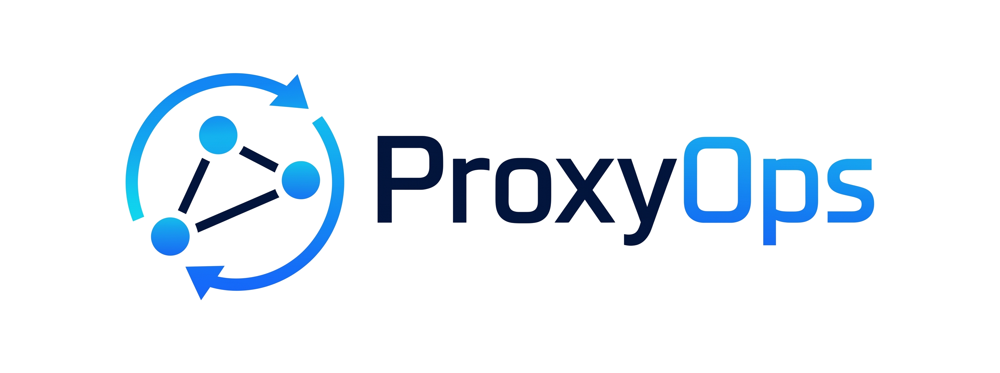
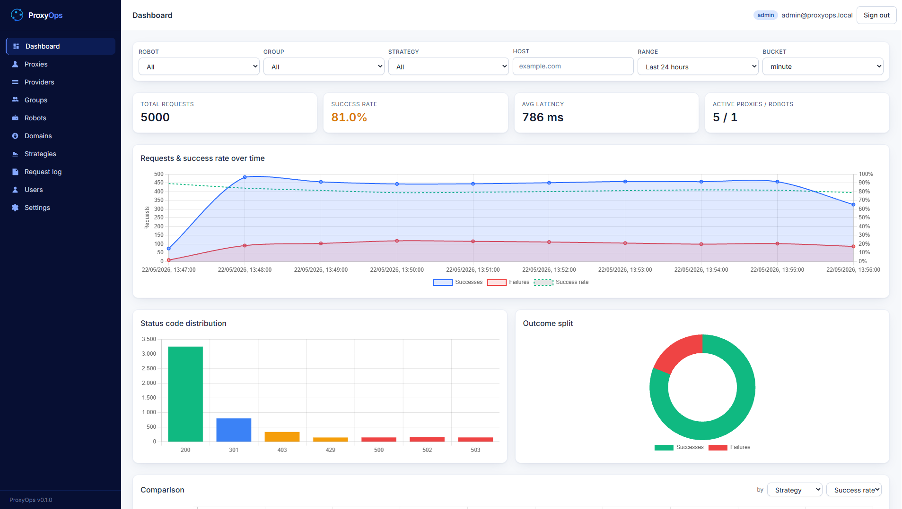
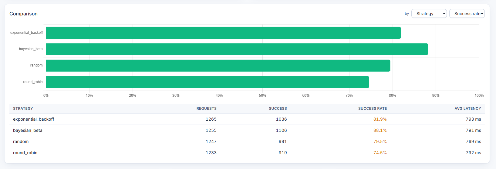
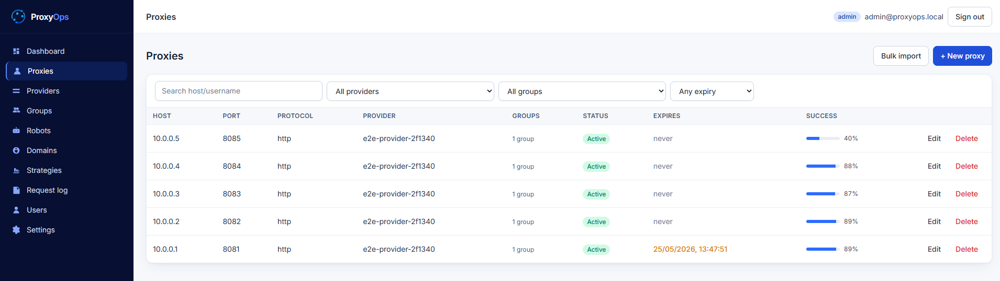
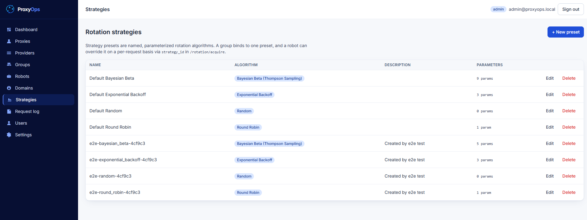
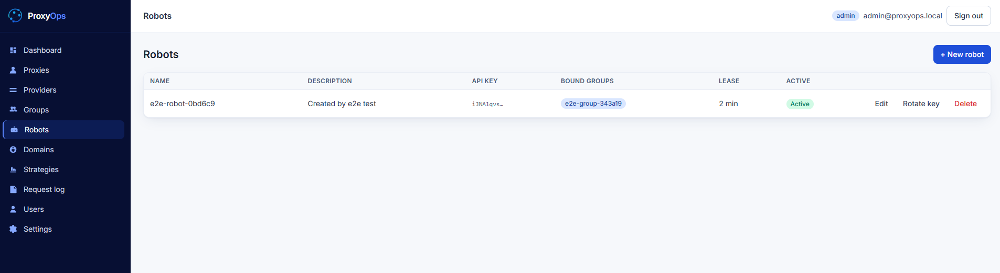
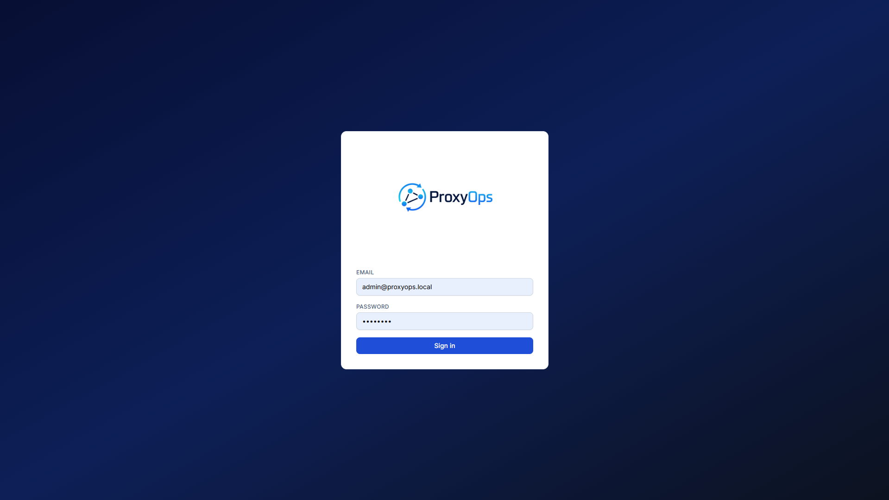

<div align="center">
  

  <h1>ProxyOps</h1>

  <p><strong>Proxy fleet manager for data-scraping robots.</strong></p>
  <p>Multi-provider proxy inventory, smart rotation strategies, robot-aware groups, and real-time success-rate analytics — all wrapped in a clean infrastructure-grade UI.</p>

  <p>
    
    
    
    
    
  </p>
</div>

---

## Why ProxyOps?

Running web-scraping fleets at scale means juggling proxies from many providers, each with its own quotas, expiration dates, and reliability profile. ProxyOps gives you a single control plane to:

- **Inventory proxies** from many providers, with expiration tracking and per-proxy health.
- **Group proxies** and bind groups to specific robots — production crawlers stay isolated from experiments.
- **Rotate intelligently** with four strategies (Round Robin, Random, Bayesian Beta, Exponential Backoff), each parameterizable per group.
- **Observe everything** — every request from every robot is logged with status code, latency, and target domain, and surfaced as filterable dashboards.

## Architecture

```text
+--------------+   HTTPS    +--------------+    SQL    +--------------+
|  Vue 3 SPA   | ---------> |   FastAPI    | --------> |  PostgreSQL  |
|  (nginx)     | <--------- |  REST + JWT  | <-------- |   (pg 16)    |
+--------------+            +--------------+           +--------------+
                                  ^
                                  | rotation API (X-Robot-Key)
                           +--------------+
                           |   Scraping   |
                           |    Robots    |
                           +--------------+
```

- **Backend** — FastAPI + SQLAlchemy 2.0 + Alembic migrations + JWT auth with role-based access (`admin`, `operator`, `viewer`).
- **Frontend** — Vue 3 + Vite + TypeScript + Pinia + Tailwind CSS, fully responsive down to mobile.
- **Database** — PostgreSQL 16 with indices tuned for time-series log queries.
- **Runtime** — Three containers wired up with `docker-compose`.

## Quick start

```bash
git clone https://github.com/<you>/proxyops.git
cd proxyops
cp .env.example .env       # tweak secrets
docker compose up -d --build
```

That's it. Open:

| URL                                | What                              |
| ---------------------------------- | --------------------------------- |
| http://localhost:5173              | Web UI                            |
| http://localhost:8000/docs         | Interactive API (Swagger)         |
| http://localhost:8000/redoc        | Reference API (ReDoc)             |

Default credentials are seeded on first boot:

```
email:    admin@proxyops.io
password: changeme
```

Change the password from **Settings → Users** immediately.

## Screenshots

> Screenshots live in [`docs/images/`](docs/images/). Capture the views below and
> drop them in with these exact filenames and they'll render here automatically.

| Dashboard | Strategy comparison |
| --- | --- |
|  |  |

| Proxy inventory | Strategy presets |
| --- | --- |
|  |  |

| Robots | Login |
| --- | --- |
|  |  |

## Features

### Proxy inventory
- Multi-provider catalog with contact, billing notes, and renewal dates.
- Per-proxy `host:port`, protocol (`http`, `https`, `socks4`, `socks5`), credentials, expiration date, and free-form metadata (JSON).
- Bulk-import via CSV.

### Robots & groups
- Each robot is a first-class entity with an API key.
- Many-to-many relationship between **robots** and **proxy groups** — a robot consuming a group can only see proxies in that group.
- Per-group default rotation strategy with its own parameters.

### Rotation strategies
All strategies are parameterizable. You can save **named presets** ("aggressive-beta", "slow-backoff") and bind them to groups.

| Strategy                | Parameters                                                                                   |
| ----------------------- | -------------------------------------------------------------------------------------------- |
| `round_robin`           | `max_logs_per_proxy`                                                                         |
| `random`                | _none_                                                                                       |
| `bayesian_beta`         | `decay_rate_success`, `decay_rate_error`, `error_multiplier`, `initial_alpha`, `initial_beta`, `min_total_requests`, `success_delay_seconds`, `max_logs_per_proxy` |
| `exponential_backoff`   | `base_backoff_minutes`, `max_backoff_minutes`, `max_logs_per_proxy`                          |

Rotation is invoked by robots with a single `POST /api/v1/rotation/acquire`. Robots later call `POST /api/v1/rotation/release` with the outcome (status code, latency, error message) — and the next rotation decision uses that signal.

### Observability
- **Dashboard** — success-rate timeseries, top domains, top failing proxies, status-code distribution.
- **Filters** — robot, group, domain, status-code range, time range.
- **Robot behavior** — every status code the robot observed is stored and aggregatable.

## API examples

```bash
# 1) Acquire a proxy
curl -X POST http://localhost:8000/api/v1/rotation/acquire \
  -H "X-Robot-Key: <robot_api_key>" \
  -H "Content-Type: application/json" \
  -d '{"target_url":"https://example.com/page"}'
# => { "proxy": { "host":"1.2.3.4","port":8080,"username":"u","password":"p" }, "lease_id": 42 }

# 2) Use the proxy, then report the outcome
curl -X POST http://localhost:8000/api/v1/rotation/release \
  -H "X-Robot-Key: <robot_api_key>" \
  -H "Content-Type: application/json" \
  -d '{"lease_id":42,"status_code":200,"duration_ms":812,"success":true}'
```

Full reference at `/docs`.

## Development

### Backend
```bash
cd backend
python -m venv .venv && . .venv/Scripts/activate  # PowerShell: .\.venv\Scripts\Activate.ps1
pip install -e .[dev]
uvicorn app.main:app --reload
```

### Frontend
```bash
cd frontend
npm install
npm run dev
```

### Migrations
```bash
cd backend
alembic revision --autogenerate -m "describe change"
alembic upgrade head
```

### Tests
```bash
cd backend && pytest
cd frontend && npm test
```

## Project layout

```
proxyops/
├── backend/                  FastAPI service
│   ├── app/
│   │   ├── api/v1/           HTTP routers
│   │   ├── core/             config, security, deps
│   │   ├── db/               session, base
│   │   ├── models/           SQLAlchemy ORM models
│   │   ├── schemas/          Pydantic DTOs
│   │   └── services/
│   │       └── strategies/   rotation strategies
│   └── alembic/              migrations
├── frontend/                 Vue 3 SPA
│   └── src/
│       ├── api/              typed API client
│       ├── components/       reusable UI
│       ├── stores/           Pinia
│       └── views/            page-level components
├── docs/                     additional docs
└── docker-compose.yml
```

## Credits & roots

The Bayesian Beta and Exponential Backoff strategies were originally designed and
benchmarked as part of a master's thesis on adaptive proxy recommendation systems.
ProxyOps is the productionized, multi-tenant evolution of that research.

## References

If you use ProxyOps or its rotation strategies in academic work, please cite:

- **P. H. C. de Souza.** *Adaptive proxy selection with Thompson sampling and Bayesian
  methods* (orig. "Seleção adaptativa de proxies com amostragem de Thompson e métodos
  Bayesianos"). Master's thesis, Graduate Program in Electrical and Computer Engineering,
  Federal University of Goiás (UFG), 2025.
  https://repositorio.bc.ufg.br/tede/items/7c8a0f0f-a5b4-4eda-b6de-8a5a98d587e2

- **P. H. C. de Souza, L. da C. Brito, and T. C. Marques.** *Bayesian Modeling for
  Adaptive Proxy Recommendation in Automated Systems* (orig. "Modelagem Bayesiana para
  Recomendação Adaptiva de Proxies em Sistemas Automatizados"). In *Proceedings of the
  Brazilian Congress on Computational Intelligence (CBIC)*, 2025.
  DOI: [10.21528/CBIC2025-1175545](https://doi.org/10.21528/CBIC2025-1175545).
  https://sbia.org.br/eventos/cbic_2025/cbic2025-1175545/

### BibTeX

```bibtex
@mastersthesis{souza2025adaptiveproxy,
  author  = {de Souza, Paulo Henrique Cardoso},
  title   = {Adaptive proxy selection with Thompson sampling and Bayesian methods},
  school  = {Federal University of Goi\'as (UFG)},
  type    = {Master's thesis},
  note    = {Graduate Program in Electrical and Computer Engineering.
             Original title: ``Sele\c{c}\~ao adaptativa de proxies com amostragem de
             Thompson e m\'etodos Bayesianos''},
  year    = {2025},
  url     = {https://repositorio.bc.ufg.br/tede/items/7c8a0f0f-a5b4-4eda-b6de-8a5a98d587e2}
}

@inproceedings{souza2025bayesianproxy,
  author    = {de Souza, Paulo Henrique Cardoso and Brito, Leonardo da Cunha and
               Marques, Thyago Carvalho},
  title     = {Bayesian Modeling for Adaptive Proxy Recommendation in Automated Systems},
  booktitle = {Proceedings of the Brazilian Congress on Computational Intelligence (CBIC)},
  year      = {2025},
  doi       = {10.21528/CBIC2025-1175545},
  url       = {https://sbia.org.br/eventos/cbic_2025/cbic2025-1175545/}
}
```

## Author

**Paulo Henrique Cardoso de Souza**
Questions, ideas, or collaboration? Reach out on
[LinkedIn](https://www.linkedin.com/in/paulo-henrique-cardoso-de-souza-ti/).

## License

MIT
